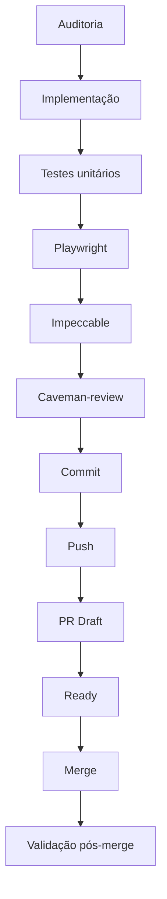

# Workflow Oficial de Desenvolvimento

Este documento descreve o fluxo padrão de desenvolvimento seguido no projeto Carteira de Investimentos.

## Fluxo Padrão

### Etapas Detalhadas

1. **Auditoria**
   - Leitura de documentos relevantes (AGENTS.md, docs/, etc.)
   - Análise do código existente e áreas afetadas
   - Identificação de pontos de risco e oportunidades
   - Consulta a habilidades relevantes quando necessário (ex: archify para arquitetura, cavecrew para escolha de workflow)

2. **Implementação**
   - Codificação seguindo as convenções do projeto
   - Foco em mudanças mínimas e verificáveis
   - Preservação de dados existentes e comportamento estável
   - Não reconstruir funções estáveis a cada fase

3. **Testes unitários**
   - Execução de `npm run test` para verificar unidade de código
   - Foco nos arquivos diretamente relacionados com a mudança
   - Também executar suites gerais exigidas pela governança do projeto

4. **Playwright**
   - Testes de ponta a ponta em navegador real
   - Validação obrigatória em múltiplos viewports: 390px, 768px, 1366px, 1920px
   - Verificação de navegação principal e secundaria, filtros, abas, ordenações, expansões
   - Checagem de console (sem erro vermelho novo), page errors e request failures
   - Validação de fluxos diretamente alterados

5. **Impeccable**
   - Auditoria de qualidade de código, clareza e consistência
   - Verificação de acessibilidade (foco, contraste, leitura por leitor de tela)
   - Verificação de responsividade
   - Verificação de performance (sem recalculo redundante, sem listener orfão)
   - Análise de riscos (dados, persistencia, compatibilidade)
   - Verificação de regressões (manuais e funcionais)

6. **Caveman-review**
   - Revisão utilizando o modo de comunicação ultra-compressa
   - Foco em decisões claras e objetivas
   - Evitar complexidade desnecessária nas discussões

7. **Commit**
   - Mensagens de commit claras e descritivas
   - Follow convencional de commits (tipo: descrição)
   - Um commit por objetivo; diffs pequenos e temáticos
   - Não misturar documentação, visual e funcional na mesma PR

8. **Push**
   - Envio dos commits para o repositório remoto
   - Branch enviada para `origin` (`git push`)
   - PR draft aberta quando aplicável

9. **PR Draft**
   - Pull Request aberta como rascunho inicialmente
   - Permite revisão preliminar antes de marcar como pronto para revisão
   - Não marcar Ready sem autorização explícita do usuário

10. **Ready**
    - Marcar PR como pronto para revisão após autorização explícita
    - Significa que todas as etapas anteriores foram concluídas e validadas
    - Nunca iniciar a próxima fase automaticamente

11. **Merge**
    - Squash merge obrigatório após revisão e aprovação
    - Não usar force push sem autorização explícita do usuário
    - Sempre encerrar documentalmente as fases funcionais antes da próxima

12. **Validação pós-merge**
    - Verificação de que o merge não quebrou funcionalidades existentes
    - Confirmação de que o build continua funcionando (`npm run build`)
    - Verificação de que os testes continuam passando

## Quando usar habilidades específicas

### archify
- Quando o usuário pedir para visualizar arquitetura do sistema, infraestrutura, fluxos de dados, sequências de API, pipelines de dados, máquinas de estado, etc.
- Para criar diagramas exploráveis como HTML standalone com SVG inline
- Quando for necessário converter/beautificar Mermaid para formatos mais ricos
- **Não usar** quando apenas precisar de documentação textual simples

### interface-design
- Ao realizar alterações na interface do usuário (UI)
- Para aplicar diretrizes de design, layout, componentes, responsividade e acessibilidade
- Quando precisar revisar hierarquia visual, tipografia, contraste, espaçamento e densidade
- Para validar comportamento em mobile (390/768) e desktop (1366/1920)
- **Não usar** para alterações puramente funcionais sem impacto visual

### playwright
- Após qualquer mudança visual ou de interação na interface
- Para validar comportamento em múltiplos viewports (390px, 768px, 1366px, 1920px)
- Quando for necessário testar navegação principal e secundaria, filtros, abas, ordenações, expansões
- Para verificar ausência de novos erros vermelhos no console
- Para validar fluxos diretamente alterados
- **Não usar** para validação de lógica de negócio pura (use testes unitários)

### impeccable
- Após implementar alterações (funcionais ou visuais)
- Para auditoria de qualidade de código, clareza e consistência
- Quando for necessário verificar acessibilidade (foco, contraste, leitura por leitor de tela)
- Para validar responsividade em múltiplos breakpoints
- Para auditoria de performance (sem recalculo redundante, sem listener orfão)
- Para análise de riscos (dados, persistencia, compatibilidade)
- Para verificar regressões (manuais e funcionais)
- **Não usar** como substituto de testes unitários ou Playwright

### caveman-review
- Para revisão de decisões técnicas e de implementação
- Quando houver necessidade de comunicação ultra-compressa e focada
- Para decisões que requerem clareza e objetividade sem elaborção desnecessária
- Quando o objetivo é dividir trabalho em pequenas partes reversíveis
- **Não usar** para tarefas que requerem comunicação elaborada ou documentação extensa

## Observações Importantes

- **Uma mudança por objetivo**: cada PR deve abordar um único objetivo funcional ou de documentação
- **Não fazer merge sem autorização explícita**: o usuário deve aprovar cada etapa crítica
- **Testar somente os arquivos diretamente relacionados**: embora suites gerais também sejam exigidas, o foco inicial é nos arquivos modificados
- **Rollback facil**: cada mudança deve poder ser revertida de forma simples
- **Preservar dados existentes**: carteira, proventos, renda fixa, metas, backup nunca devem ser reconstruídos desnecessariamente